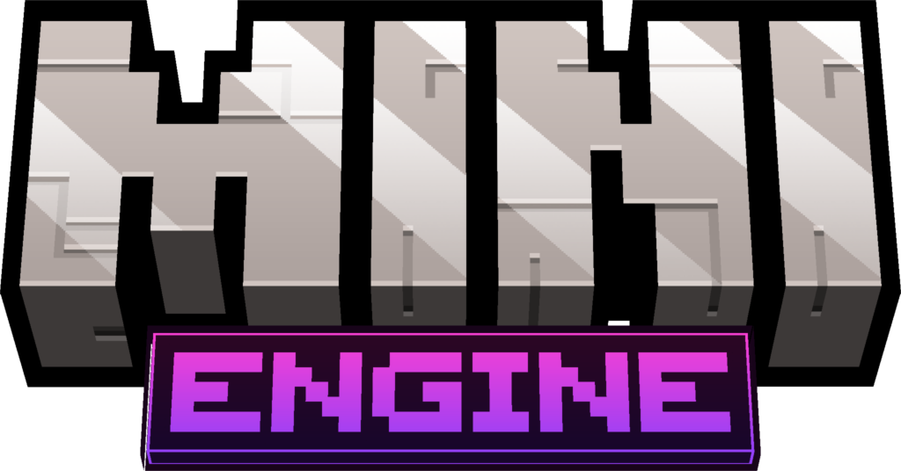

A Kotlin library for running instanced Paper minigames powered by ASP.

[**Quickstart**](QUICKSTART.md) • [**Requirements**](#requirements) • [**Game Loop**](#game-loop) • [**API Reference**](#api-reference) • [**License**](#license)

---

MiniEngine handles the common boilerplate for minigames:

- **RAM-based worlds**: Clones and discards arena worlds using ASP templates instead of copying world folders on disk.
- **Async world loading**: Offloads ASP world reading and cloning to background threads.
- **Phase loop**: Built-in state machine for loading, recruiting, countdowns, active matches, and cleanup.
- **Player tracking**: Keeps track of alive players, spectators, and winners, with built-in state restoration on join/leave.
- **Scoped events**: Register Bukkit listeners that automatically filter by game phase, arena world, and participant status.

## Requirements

- **Java 25**
- **PaperMC 26.1.2**
- **[AdvancedSlimePaper](https://github.com/InfernalSuite/AdvancedSlimePaper)** installed on the server

## Game Loop

Each game moves through sequential phases:

| Phase | Next Phase | Description |
| :--- | :--- | :--- |
| **`GameLoadingPhase`** | `GameRecruitingPhase` | Reads the `.slime` template asynchronously, clones into a new world instance, and fires `GameReadyEvent`. |
| **`GameRecruitingPhase`** | `GameCountdownPhase` | Waits for players. Advances once `players.size >= minPlayers`. |
| **`GameCountdownPhase`** | `GameActivePhase` | Ticks down (20s default) with sound and chat alerts. Cancels back to Recruiting if players leave. Distributes players to arena spawns on finish. |
| **`GameActivePhase`** | `GameEndingPhase` | Match is live (`allowPVP = true`). Calls `onGameStart()` on entry and `onGameTick()` every second. |
| **`GameEndingPhase`** | `GameResettingPhase` | Winner celebration window (10s default). Calls `onGameEnd()`. |
| **`GameResettingPhase`** | `GameRecruitingPhase` | Evacuates players to the lobby, unloads the world without saving, clones a fresh arena instance, and resets game state. |

### Phase Flags

Phases configure baseline interaction rules:

| Flag | Default | Notes |
| :--- | :--- | :--- |
| `allowPVP` | `false` | Enabled in `GameActivePhase`. Automatically blocked in all other phases and for spectators. |
| `allowBlockBreak` | `false` | Blocked outside permitted phases. |
| `allowBlockPlace` | `false` | Blocked outside permitted phases. |
| `allowHunger` | `false` | Cancels food level depletion outside permitted phases. |

## Quickstart

See [QUICKSTART.md](QUICKSTART.md) for an example of setting up a game class and running it inside a plugin.

## API Reference

### `Game` methods

| Method | Description |
| :--- | :--- |
| `start()` | Starts the tick loop and enters the initial `GameLoadingPhase`. |
| `stop()` | Cancels tasks, unregisters listeners, restores players, and teleports them to the lobby. |
| `join(player)` | Adds a player if the game is in recruiting or countdown and below `maxPlayers`. |
| `leave(player)` | Removes a player, restores their state, teleports them to the lobby, and cancels countdown if below `minPlayers`. |
| `eliminate(player)` | Moves a player from alive to spectators, resets their state, and fires `GamePlayerEliminatedEvent`. |
| `distributePlayersToSpawns()` | Teleports each alive player across the arena's configured spawn points. |
| `cleanPlayer(player, gameMode)` | Resets health, hunger, saturation, effects, fire ticks, and clears inventory. |
| `cleanAllPlayers(gameMode)` | Cleans every alive player and spectator in the game. |
| `broadcast(action)` | Executes an action block on every alive player and spectator. |
| `message(miniMessage)` | Sends a MiniMessage-formatted chat message to all participants. |
| `sound(sound, volume, pitch)` | Plays a sound to all participants. |
| `isParticipating(player)` | Returns whether a player is currently in the game (alive or spectating). |
| `sendEvent(event)` | Transitions the game to the next phase based on the given `GameEvent`. |
| `on<E : Event>(*phases) { ... }` | Registers a listener that only triggers for participants inside the arena during the specified phases. |

## License

This project is licensed under the [MIT License](LICENSE).
